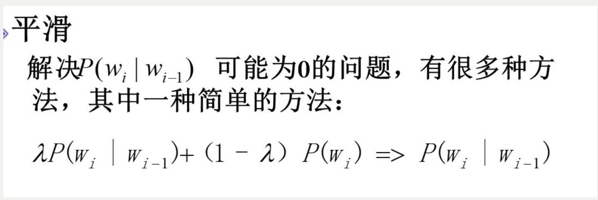

<bold>**拼音输入法报告** &nbsp;&nbsp;</bold> <small>2021080070 计14 韩佑硕 </small> 

# **基于字的二元模型算法**

# **实验环境**

# **使用语料库和数据预处理方法**

# **训练方法**
## **剪纸策略**
时空效率与准确度的trade off  
计算出概率，取TOP K大的概率对应的字  

# **处理方法及效率比较**

## **不同 COUNT_THRESHOLD的效率比较**
## **不同 TOP_K 准确率比较**

## **词频为0的处理方法**

### **平滑**

## **第一个字处理方法以及效率**
### **计算出每个汉字在词频表出现的概率，选其中概率最大的k个**
### **计算出每个词作为首个字出现的频度(frequency_dict_first)**

## **“原标题"处理方式**
### **给平均频度**
#### **不同FIRST_COUNT_THRESHOLD的效率比较**

